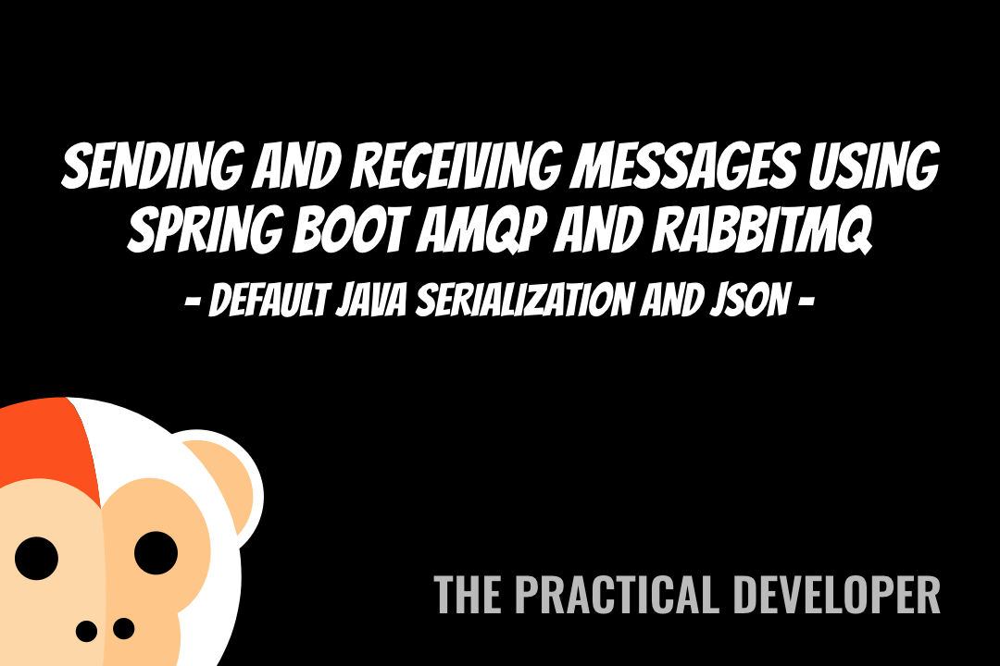

# Spring Boot 2 и настройка RabbitMQ JSON

Простое приложение `Spring Boot` 2, демонстрирующее, как использовать сериализацию JSON с помощью 
`RabbitMQ`.

Это исходный код, используемый в видео Отправляя и Получая сообщения с использованием `Spring Boot AMQP` и `RabbitMQ`. 
Код взят из ведео на [Youtube] (https://www.youtube.com/watch?v=yuApTF_HeWM).

Перед запуском приложения, необходимо запустить очередь с помощью docker команды:

```
docker-compose up
```

[](https://www.youtube.com/watch?v=yuApTF_HeWM)
